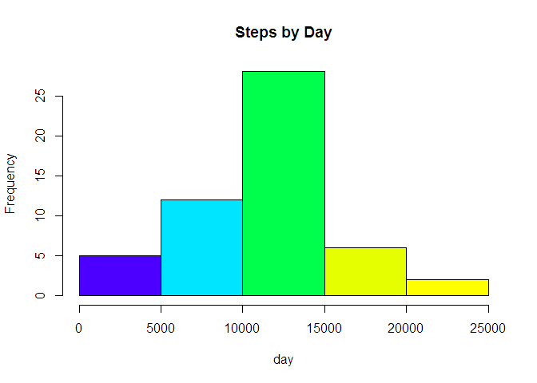
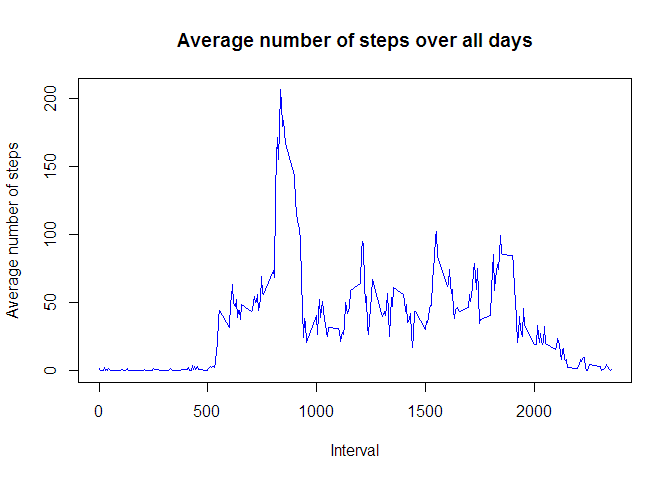
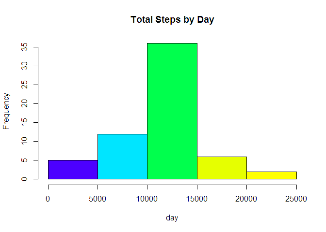
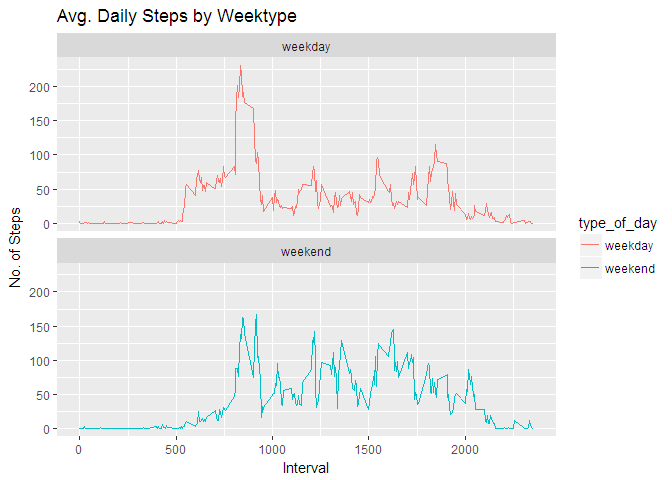

Input data

    activity <- read.csv("activity.csv", header = TRUE, sep = ",")
    head(activity)

    ##   steps       date interval
    ## 1    NA 2012-10-01        0
    ## 2    NA 2012-10-01        5
    ## 3    NA 2012-10-01       10
    ## 4    NA 2012-10-01       15
    ## 5    NA 2012-10-01       20
    ## 6    NA 2012-10-01       25

    #Calculate the total number of steps taken each day.
    #I will use aggregate function to calculate sum, mean, and median number of steps
    #I will Ignore missing values with na.rm = T
    StepsByDay <- aggregate(steps ~ date, data = activity, sum, na.rm = TRUE)

Histogram of the total number of steps taken each day

    require("RColorBrewer")

    ## Loading required package: RColorBrewer

    hist(StepsByDay$steps, main = "Steps by Day", xlab = "day", col = topo.colors(6)) 

Calculate the mean and median number of steps taken each day

    aggregate(steps ~ date, data = activity, FUN = mean, na.rm =TRUE)

    ##          date      steps
    ## 1  2012-10-02  0.4375000
    ## 2  2012-10-03 39.4166667
    ## 3  2012-10-04 42.0694444
    ## 4  2012-10-05 46.1597222
    ## 5  2012-10-06 53.5416667
    ## 6  2012-10-07 38.2465278
    ## 7  2012-10-09 44.4826389
    ## 8  2012-10-10 34.3750000
    ## 9  2012-10-11 35.7777778
    ## 10 2012-10-12 60.3541667
    ## 11 2012-10-13 43.1458333
    ## 12 2012-10-14 52.4236111
    ## 13 2012-10-15 35.2048611
    ## 14 2012-10-16 52.3750000
    ## 15 2012-10-17 46.7083333
    ## 16 2012-10-18 34.9166667
    ## 17 2012-10-19 41.0729167
    ## 18 2012-10-20 36.0937500
    ## 19 2012-10-21 30.6284722
    ## 20 2012-10-22 46.7361111
    ## 21 2012-10-23 30.9652778
    ## 22 2012-10-24 29.0104167
    ## 23 2012-10-25  8.6527778
    ## 24 2012-10-26 23.5347222
    ## 25 2012-10-27 35.1354167
    ## 26 2012-10-28 39.7847222
    ## 27 2012-10-29 17.4236111
    ## 28 2012-10-30 34.0937500
    ## 29 2012-10-31 53.5208333
    ## 30 2012-11-02 36.8055556
    ## 31 2012-11-03 36.7048611
    ## 32 2012-11-05 36.2465278
    ## 33 2012-11-06 28.9375000
    ## 34 2012-11-07 44.7326389
    ## 35 2012-11-08 11.1770833
    ## 36 2012-11-11 43.7777778
    ## 37 2012-11-12 37.3784722
    ## 38 2012-11-13 25.4722222
    ## 39 2012-11-15  0.1423611
    ## 40 2012-11-16 18.8923611
    ## 41 2012-11-17 49.7881944
    ## 42 2012-11-18 52.4652778
    ## 43 2012-11-19 30.6979167
    ## 44 2012-11-20 15.5277778
    ## 45 2012-11-21 44.3993056
    ## 46 2012-11-22 70.9270833
    ## 47 2012-11-23 73.5902778
    ## 48 2012-11-24 50.2708333
    ## 49 2012-11-25 41.0902778
    ## 50 2012-11-26 38.7569444
    ## 51 2012-11-27 47.3819444
    ## 52 2012-11-28 35.3576389
    ## 53 2012-11-29 24.4687500

    aggregate(steps ~ date, data = activity, FUN = median, na.rm =TRUE)

    ##          date steps
    ## 1  2012-10-02     0
    ## 2  2012-10-03     0
    ## 3  2012-10-04     0
    ## 4  2012-10-05     0
    ## 5  2012-10-06     0
    ## 6  2012-10-07     0
    ## 7  2012-10-09     0
    ## 8  2012-10-10     0
    ## 9  2012-10-11     0
    ## 10 2012-10-12     0
    ## 11 2012-10-13     0
    ## 12 2012-10-14     0
    ## 13 2012-10-15     0
    ## 14 2012-10-16     0
    ## 15 2012-10-17     0
    ## 16 2012-10-18     0
    ## 17 2012-10-19     0
    ## 18 2012-10-20     0
    ## 19 2012-10-21     0
    ## 20 2012-10-22     0
    ## 21 2012-10-23     0
    ## 22 2012-10-24     0
    ## 23 2012-10-25     0
    ## 24 2012-10-26     0
    ## 25 2012-10-27     0
    ## 26 2012-10-28     0
    ## 27 2012-10-29     0
    ## 28 2012-10-30     0
    ## 29 2012-10-31     0
    ## 30 2012-11-02     0
    ## 31 2012-11-03     0
    ## 32 2012-11-05     0
    ## 33 2012-11-06     0
    ## 34 2012-11-07     0
    ## 35 2012-11-08     0
    ## 36 2012-11-11     0
    ## 37 2012-11-12     0
    ## 38 2012-11-13     0
    ## 39 2012-11-15     0
    ## 40 2012-11-16     0
    ## 41 2012-11-17     0
    ## 42 2012-11-18     0
    ## 43 2012-11-19     0
    ## 44 2012-11-20     0
    ## 45 2012-11-21     0
    ## 46 2012-11-22     0
    ## 47 2012-11-23     0
    ## 48 2012-11-24     0
    ## 49 2012-11-25     0
    ## 50 2012-11-26     0
    ## 51 2012-11-27     0
    ## 52 2012-11-28     0
    ## 53 2012-11-29     0

Time series plot of the average number of steps taken

    #Make time series plot of the 5-minute interval (x-axis) and the average number
    #of steps taken, averaged across all days (y-axis)

    time_series <- tapply(activity$steps, activity$interval, mean, na.rm = TRUE)
    plot(row.names(time_series), time_series, type = "l", xlab = "Interval", 
         ylab = "Average number of steps", main = "Average number of steps over all days",
         col = "blue")

The 5-minute interval that, on average, contains the maximum number of
steps

    max_interval <- which.max(time_series)
    names(max_interval)

    ## [1] "835"

Imputing missing data

    #Note that there are a number of days/intervals where there are missing values
    #(coded as NA). The presence of missing days may introduce bias into some 
    #calculations or summaries of the data. We will calculate and report the total
    #number of missing values in the dataset #(i.e. the total number of rows with NAs)

    activity_NA <- sum(is.na(activity))
    activity_NA

    ## [1] 2304

    #Devise a strategy for filling in all of the missing values in the dataset.
    StepsAverage <- aggregate(steps ~ interval, data = activity, FUN = mean)
    fill_NA <- numeric()
    for (i in 1:nrow(activity)) {
            na <- activity[i, ]
            if (is.na(na$steps)) {
                    steps <- subset(StepsAverage, interval == na$interval)$steps
            } else {
                    steps <- na$steps
            }
            fill_NA <- c(fill_NA, steps)
    }

    #Create a new dataset that is equal to the original dataset but with 
    #the missing data filled in.
    new_activity <- activity
    new_activity$steps <- fill_NA

Make a histogram of the total number of steps taken each day after
missing values are imputed

    new_StepsByDay <- aggregate(steps ~ date, data = new_activity, sum, na.rm = TRUE)

    #Create a histogram
    require("RColorBrewer")
    hist(new_StepsByDay$steps, main = "Total Steps by Day", xlab = "day", col = topo.colors(6))

Panel plot comparing the average number of steps taken per 5-minute
interval across weekdays and weekends

    #Create a new  a new variable "type_of_day" indicating whether a 
    #given date is a weekday or #weekend day.
    new_activity['type_of_day'] <- weekdays(as.Date(new_activity$date))
    new_activity$type_of_day[new_activity$type_of_day  %in% c('Saturday','Sunday') ] <- "weekend"
    new_activity$type_of_day[new_activity$type_of_day != "weekend"] <- "weekday"

    # convert "type_of_day" from character to factor
    new_activity$type_of_day <- as.factor(new_activity$type_of_day)

    # calculate average steps by interval across all days

    df_imputed_steps_by_interval <- aggregate(steps ~ interval + type_of_day, new_activity, mean)

    #create a plot
    require(ggplot2)

    ## Loading required package: ggplot2

    ## Warning: package 'ggplot2' was built under R version 3.3.3

    plot<- ggplot(df_imputed_steps_by_interval, aes(x =interval , y=steps, color=type_of_day)) +
            geom_line() +
            labs(title = "Avg. Daily Steps by Weektype", x = "Interval", y = "No. of Steps") +
            facet_wrap(~ type_of_day, ncol = 1, nrow=2)
    print(plot)

